# Praktikum Modul 1 Jaringan Komputer
## Nama kelompok: 
1. Lia Kharisma Putri (5025201034) 
2. Azzura Ferliani Ramadhani (5025201190) 
3. Ingwer Ludwig Nommensen (5025201259) 

## Nomor 1
1. Pilih jaringan (wifi apabila pakai wifi)
2. Di wireshark, lakukan filter dengan command http
3. Pilih salah satu packet, kemudian klik kanan, lalu follow TCP Stream
4. Liat di hasilnya, find kata “server”, jawabannya Server: nginx/1.10.3
5. Hasil: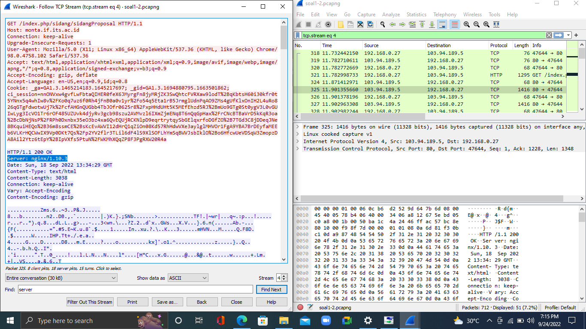
## Nomor 2
1. Buka file `soal1-2.pcapng`
2. Cari yang info nya ada alamat “detail topik” dengan command `http contains "detail"`
3. Pilih filename 194 dan save
4. Export object as HTTP dan buka di tempat eksport
5. Jawabannya Evaluasi unjuk kerja User Space Filesystem (FUSE)
6. Hasil: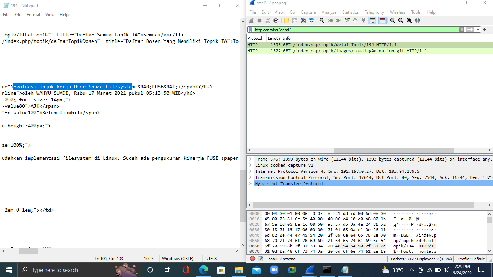
## Nomor 3
1. Buka soal `soal3-6.pcapng`
2. Terapkan display filter `tcp.dstport == 80`
3. Hasil: 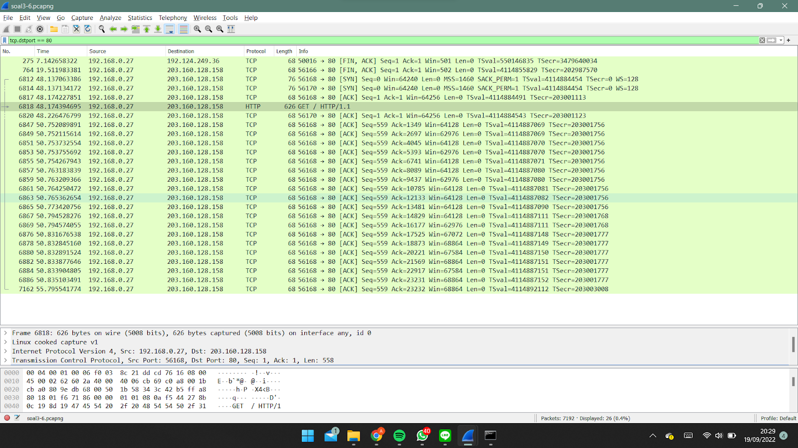
## Nomor 4
1. Buka soal `soal3-6.pcapng`
2. Terapkan display filter `tcp.srcport == 21`
3. Hasil: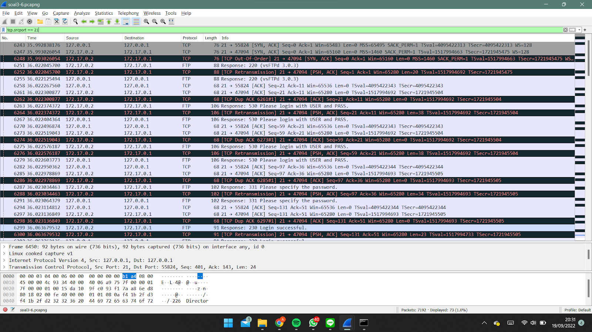
## Nomor 5
1. Buka soal `soal3-6.pcapng`
2. Terapkan display filter `tcp.srcport == 443`
3. Hasil: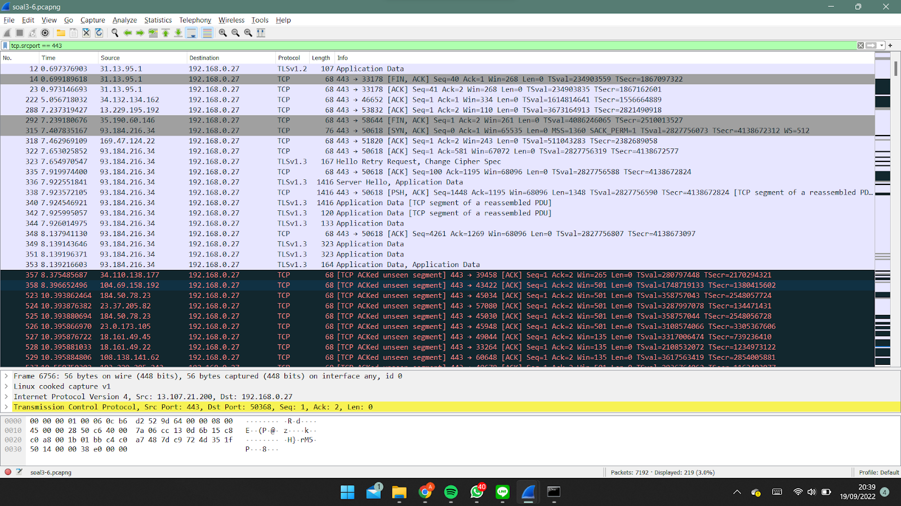
## Nomor 6
1. Buka soal `soal3-6.pcapng`
2. Dikarenakan ip dari lipi.go.id belum diketahui, maka cek terlebih dahulu menggunakan filter `http contains lipi.go.id`
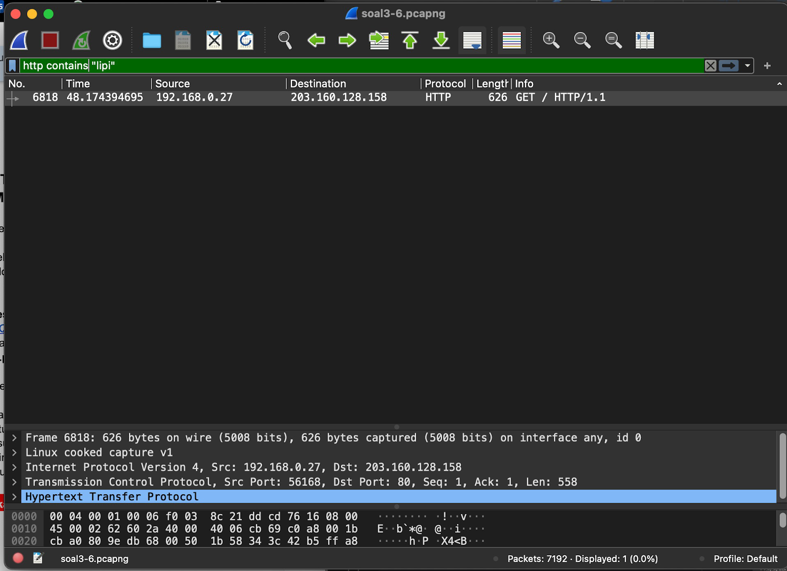
3. Diketahui ip dari lipi.go.id adalah `203.160.128.158`
4. Terapkan display filter `ip.dst == 203.160.128.158`
5. Hasil: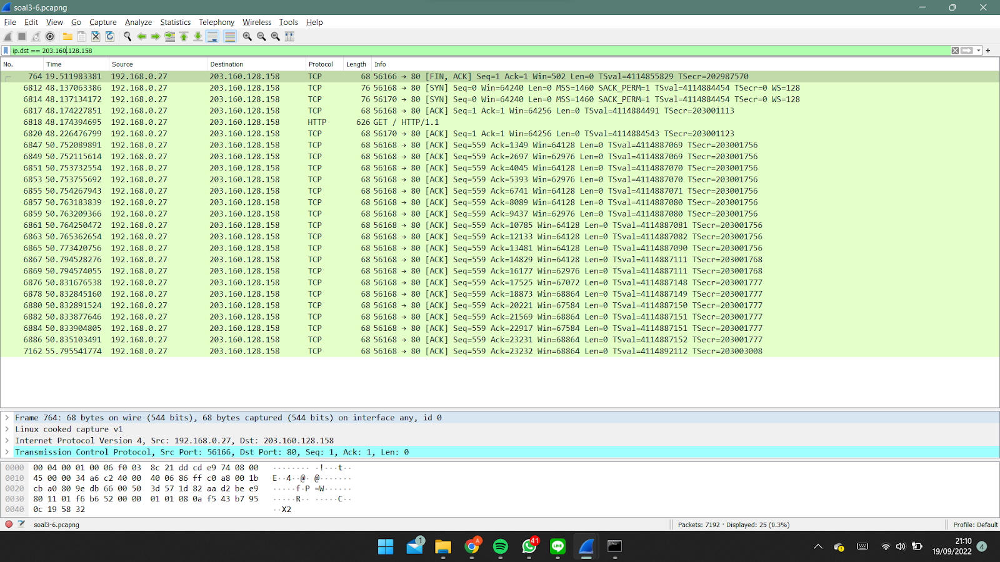
# Nomor 7
1. Pilih jaringan (wifi apabila pakai wifi)
2. Lakukan ping menggunakan cmd dengan command “ipconfig” untuk mengetahui ip kita
3. Masukkan filter pada wireshark dengan command “ip.src == <ip yang digunakan>” `ip.src==10.8.108.197`
7. Hasil: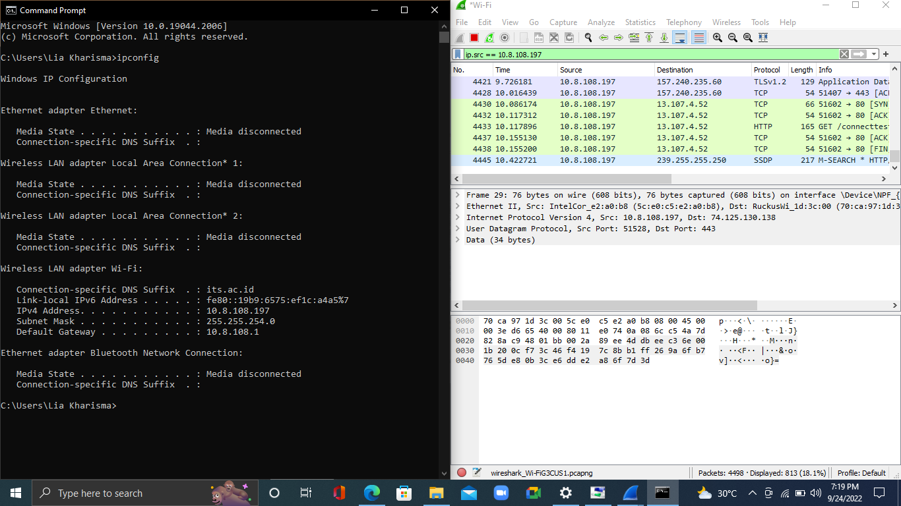
# Nomor 8
1. Buka packet yang berisikan percakapan antara dua mahasiswa dan lakukan follow tcp stream
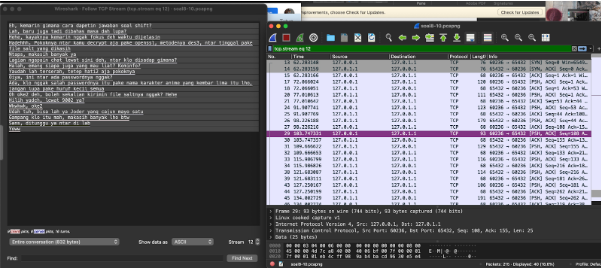
# Nomor 9
1. Karena petunjuknya kecurangan dilakukan di port 9002, maka filter port 9002 tcp.port == 9002
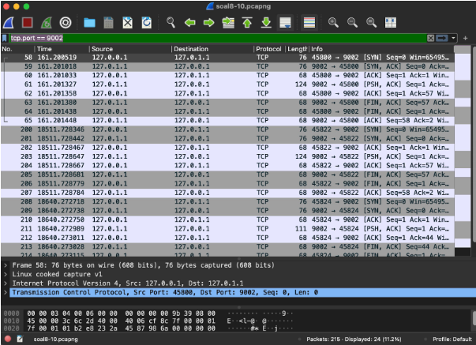
2. Follow tcp stream, kemudian ke stream 29, terdapat salt yang desediakan, tampilkan as raw dan save menjadi nama_kelompok.des3 (E09) `(53616c7465645f5fbf3adfafa4884228ce051bd1f6c12445a416e84b29c1d63c3c081b
8bb9fcf566209587961317e142ff4734e4da2bcbcf)`
3. Untuk mendecrypt, dibutuhkan password. Dari info yang didapatkan dari packet 29 tcp streamnya, terdapat keterangan anime 5 kembar source link : `https://skdesu.com/id/gotoubun-hanayome-quintuple`
4. Kita mendapatkan kemungkinan passsword yang pertama yaitu “nakano”
5. Decrypt dengan metode des3 dengan command : openssl des -d -salt -in E09.des3-out flag.txt
6. Change directory ke tempat salt di save as. Kemudian jalankan command tersebut
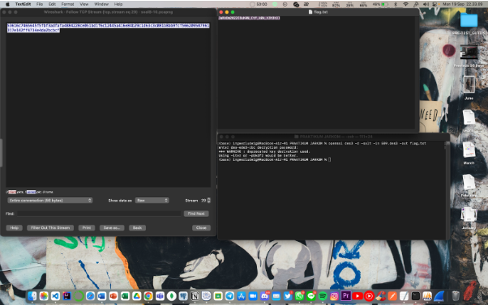
## Nomor 10
  `JaRkOm2022{8uK4N_CtF_k0k_h3h3h3}`
